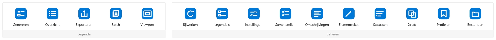

# NLCS Legenda

[](https://github.com/joligej/infracad-helper/actions/workflows/ci.yml)
[](https://github.com/joligej/infracad-helper/releases/latest)
[](LICENSE)

Voor een NLCS-tekening teken je de legenda meestal met de hand: voor elk element
een blokje, de juiste arcering erin en de tekst ernaast. Dat werk neemt deze plugin
over. Hij leest de InfraCAD/NLCS-lagen die al in je Civil 3D- of AutoCAD-tekening
zitten en zet daar de bijbehorende legenda bij, in dezelfde stijl.



## Zo werkt het

Start `NLCSLEGENDA`. Je kunt eerst nog de schaal of een paar opties zetten; daarna
hangt de legenda aan je cursor en zet je hem naast de tekening neer. Standaard maakt hij
een legenda van de hele tekening; kies je in het optiemenu `Selecteren`, dan komt er een
legenda van alleen die selectie. Alles komt als losse objecten in de model space, op de
eigen NLCS-lagen, dus kleur en lijntype kloppen meteen. Wie liever klikt dan typt vindt
in het lint een tab **NLCS Legenda** met dezelfde functies.

Je kunt meerdere legenda's naast elkaar in één tekening hebben, bijvoorbeeld één voor de
hele tekening en aparte legenda's voor deelgebieden. Elke legenda onthoudt zijn eigen
bron (hele tekening of selectie) en zijn eigen instellingen. `NLCSLEGENDABEHEER` toont de
legenda's en laat je ze bijwerken, hernoemen, opzoeken (zoomen) en verwijderen.

Is het ontwerp veranderd, dan tekent `NLCSLEGENDAUPDATE` de legenda opnieuw op precies
dezelfde plek. Is er één legenda, dan gaat dat direct; bij meerdere klik je de gewenste
legenda aan (of kies je uit een lijst). Een selectielegenda wordt daarbij opnieuw van
diezelfde selectie opgebouwd, niet van de hele tekening. `NLCSLEGENDAVIEWPORT` maakt in
de paper space een viewport rond de gekozen legenda op de ingestelde schaal.

De globale instellingen zijn het startpunt voor een **nieuwe** legenda. Zet je later de
globale standaard anders, dan verandert een bestaande legenda niet mee: die houdt de
instellingen waarmee hij is gemaakt. Instellingen bewerk je met `NLCSLEGENDAOPTIES`, de
omschrijvingen met `NLCSLEGENDAOMSCHRIJVINGEN`, en `NLCSLEGENDATEKST` past de tekst van
één aangeklikt element aan.

Onder de legenda komen standaard een meeschalende schaalbalk en een opmerkingenblok.
Allebei kun je uitzetten of aanpassen.

`NLCSLEGENDAEXPORT` schrijft de regels van de huidige tekening weg als CSV en JSON.
Wil je een hele projectmap in één keer, dan leest `NLCSLEGENDABATCH` elke DWG in een
gekozen map (zonder ze te openen of te wijzigen) en zet alles in één uittrekstaat met
een kolom *Tekening*; een tekening die niet leesbaar is, wordt overgeslagen en gemeld.

Niet elke NLCS-laag hoeft in de legenda. Met `NLCSLEGENDAUITVINKEN` klik je een
element aan om die regel weg te laten (of weer terug te zetten). Heb je een eigen laag
die er juist wél bij hoort, dan maak je met `NLCSLEGENDATOEVOEGEN` een regel aan: je
kiest het type (lijn, vlak, arcering, vlakvulling of symbool), de laag en de
omschrijving. In `NLCSLEGENDABEHEER` staat dit bij elkaar in één venster. Het uitvinken
en de eigen regels bewaar je globaal of per tekening.

Je kunt ook per elementsoort kiezen wat in de legenda komt: geometrie/lijnen, vlakken,
arceringen, vlakvullingen en symbolen zijn afzonderlijk aan of uit te zetten. Standaard
staat alles aan. Je vindt dit in `NLCSLEGENDAOPTIES` onder *Elementsoorten* en in het
keuzemenu vóór het plaatsen. `NLCSLEGENDAINFO` meldt welke soorten uitstaan.

Naast de vaste statussen (Nieuw, Bestaand, Vervallen, Tijdelijk, Revisie) maak je met
`NLCSLEGENDASTATUS` eigen statussen aan. Daar wijs je regels aan toe: automatische
NLCS-lagen door ze in de tekening aan te wijzen, handmatige regels via een lijstje. Zo'n
regel verschijnt dan onder de eigen kopregel, ook als de gewone status ervan uitstaat.

Werk je met externe referenties, dan bepaalt `NLCSLEGENDAXREFS` per gekoppelde xref of
die meetelt. Globaal geldt één aan/uit-schakelaar; de keuze per xref leg je per tekening
vast en gaat daar vóór.

Heb je een legenda-opzet die je vaker gebruikt, dan bewaar je die met `NLCSLEGENDAPRESET`
als profiel. In een volgende tekening laad je het profiel weer, globaal of alleen voor die
tekening. Zo hoef je schaal, teksten en opmaak niet telkens opnieuw in te stellen. Een
profiel kun je ook exporteren naar een `.json`-bestand en op een andere computer weer
importeren, zodat je een opzet met collega's kunt delen.

| Commando | Doet |
|----------|------|
| `NLCSLEGENDA` | Legenda genereren en met de muis plaatsen (hele tekening of selectie). |
| `NLCSLEGENDAUPDATE` | Een legenda opnieuw tekenen op dezelfde plek; bij meerdere kies je welke. |
| `NLCSLEGENDABEHEER` | Legenda's bekijken, bijwerken, hernoemen, opzoeken en verwijderen. |
| `NLCSLEGENDAINFO` | Tonen wat erin zou komen (aantallen, lengtes, oppervlakten, totalen per hoofdgroep) en welke regels nog een eigen omschrijving missen, zonder te tekenen. |
| `NLCSLEGENDAEXPORT` | De regels wegschrijven als CSV en JSON, met hoeveelheden en de herkomst van elke omschrijving. |
| `NLCSLEGENDABATCH` | Alle DWG's in een map samen in één uittrekstaat (CSV/JSON) met een kolom Tekening. |
| `NLCSLEGENDAVIEWPORT` | Een viewport in de huidige layout rond de legenda, op schaal. |
| `NLCSLEGENDAOPTIES` | Alle instellingen bewerken in een venster (schaal, teksten, opmaak). |
| `NLCSLEGENDAOMSCHRIJVINGEN` | De omschrijvingen per element bewerken in een tabel. |
| `NLCSLEGENDATEKST` | Klik een element aan en pas de tekst ervan aan (meerdere regels mogelijk). |
| `NLCSLEGENDASAMENSTELLEN` | Regels uitvinken en eigen regels toevoegen in één venster. |
| `NLCSLEGENDAUITVINKEN` | Klik een element aan om die regel uit de legenda te laten. |
| `NLCSLEGENDATOEVOEGEN` | Een eigen regel toevoegen (type, laag en omschrijving zelf kiezen). |
| `NLCSLEGENDASTATUS` | Eigen statussen maken en er regels aan toewijzen (naast Nieuw/Bestaand/...). |
| `NLCSLEGENDAXREFS` | Per gekoppelde xref kiezen of die in de legenda wordt meegenomen. |
| `NLCSLEGENDAPRESET` | Legenda-instellingen als profiel opslaan, laden, en im-/exporteren als bestand. |
| `NLCSLEGENDACONFIG` | De globale configuratiebestanden aanmaken en de paden tonen. |
| `NLCSLEGENDATEST` | Plaatsen zonder vragen; bedoeld voor scripts en tests. |

## Installatie

Er zijn twee manieren, allebei bij de [releases](https://github.com/joligej/infracad-helper/releases).

**Met de installer (aanbevolen).** Download `NlcsLegenda-X.Y.Z.msi` en voer die uit.
De installer zet de plugin per gebruiker neer in `%APPDATA%\Autodesk\ApplicationPlugins`
(geen beheerdersrechten nodig), staat daarna in Windows bij *Apps* om te de-installeren,
en bevat één bestand dat voor 2025, 2026 én 2027 werkt. Start Civil 3D of AutoCAD daarna
opnieuw.

De installer is self-signed ondertekend als `joligej`. Die handtekening laat zien dat
het bestand na ondertekening niet is gewijzigd; hij zegt niets over een door een externe
autoriteit geverifieerde identiteit. Windows toont pas een vertrouwde uitgever als je het
meegeleverde `joligej-codesign.cer` zelf importeert. Doe dat alleen als je dit certificaat
vertrouwt: een certificaat in *Vertrouwde basiscertificeringsinstanties* geldt voor je hele
gebruikersprofiel. Zonder import werkt de installer gewoon, maar staat er "onbekende
uitgever". Een download controleer je met `SHA256SUMS.txt` bij de release.

**Handmatig (zip).** Download `NlcsLegenda-2027-vX.Y.Z.zip` (of de 2025-/2026-variant),
pak de map `NlcsLegenda.bundle` uit in `%APPDATA%\Autodesk\ApplicationPlugins\` en start
Civil 3D of AutoCAD opnieuw. De bundle bestaat uit twee dll's die bij elkaar horen.

Aan het ontwikkelen? Bouw met `dotnet build -c Release` en laad de gebouwde
`NlcsLegenda.dll` met `NETLOAD`. Voor 2027 geef je `-p:AcadVersion=2027` mee; dat is
.NET 10 en de dll belandt in `bin\Release\net10.0-windows`. 2025 en 2026 zijn .NET 8
(`bin\Release\net8.0-windows`).

## Welke lagen worden opgepakt

Alleen op basis van de laagnaam. Een NLCS-laag ziet er zo uit:
`N-WE-VH-OPENVERHARDING_BETONSTRAATSTEEN-A`. Het eerste teken is de status (N voor
nieuw, B voor bestaand, V voor vervallen, enzovoort); de rest beschrijft het element
en het tekentype: lijn, arcering of symbool. De volledige opbouw staat in
[docs/NLCS-conventies.md](docs/NLCS-conventies.md).

Voor de tekst naast een symbool kijkt de plugin op volgorde naar: je eigen
`textOverrides`, de laagbeschrijving die InfraCAD invult, het omschrijvingenbestand,
en anders een opgeschoonde laagnaam. Er is geen koppeling met InfraCAD of een externe
database; alles komt uit de tekening zelf. `NLCSLEGENDAINFO` laat zien welke regels op
de laagnaam terugvallen, zodat je gericht een eigen omschrijving kunt toevoegen.

Een omschrijving heeft een algemeen en een specifiek deel, bijvoorbeeld "Verharding"
en "Betonstraatsteen". Standaard toont de legenda alleen het specifieke deel; met de
optie `Algemeen` (of `includeGeneralDescription`) zet je het algemene deel ervoor.

## Configuratie

Je stelt alles in met twee vensters: `NLCSLEGENDAOPTIES` voor de instellingen en
`NLCSLEGENDAOMSCHRIJVINGEN` voor de teksten per element. Bovenin kies je waar het
wordt bewaard: voor alle tekeningen, of alleen voor deze tekening.

De globale keuze schrijft twee JSON-bestanden in `%APPDATA%\NlcsLegenda\`
(`settings.json` en `omschrijvingen.json`), los van de plugin zelf: de dll's staan in
`ApplicationPlugins` (vaak alleen-lezen) en je instellingen bij je profiel.
`NLCSLEGENDACONFIG` maakt die bestanden aan en toont de paden.

Kies je "alleen deze tekening", dan gaat de configuratie de tekening zelf in. Er komen
dan geen losse bestanden naast je `.dwg` of naast een template, en het werkt ook voor
een nog niet opgeslagen tekening. Deze keuze gaat vóór de globale. Voorbeelden van de
globale bestanden staan in [deploy/settings.sample.json](deploy/settings.sample.json)
en [deploy/omschrijvingen.sample.json](deploy/omschrijvingen.sample.json); wat je
weglaat krijgt de standaardwaarde.

## Bouwen en testen

Je hebt de .NET SDK nodig (versie 8 voor AutoCAD 2025 en 2026, versie 10 voor 2027).
AutoCAD hoeft er niet op te staan om te bouwen: is het niet geïnstalleerd, dan gebruikt
de build de `AutoCAD.NET`-referenties van NuGet.

```powershell
dotnet build NlcsLegenda.slnx -c Release
dotnet test NlcsLegenda.slnx
```

Het ontleden van laagnamen, groeperen en de opmaak zitten in `NlcsLegenda.Core`, los
van AutoCAD, en zijn dus met `dotnet test` te controleren. Wil je de hele plugin op
een echte tekening draaien, dan doet `dev/scripts/Run-HeadlessLegendTest.ps1` dat
headless via de AutoCAD Core Console. `dev/scripts/Run-IntegrationTests.ps1` draait
plaatsen, overzicht, export en bijwerken achter elkaar en controleert de resultaten.

## Beperkingen

De ingebouwde teksten dekken de gangbare elementen. Voor de rest valt de plugin
terug op de laagbeschrijving of de laagnaam. Wil je een sluitende lijst, vul dan
`omschrijvingen.json` aan; `NLCSLEGENDAINFO` wijst aan welke regels nog terugvallen op
de laagnaam. De maatvoering rekent van papier-millimeters naar modeleenheden en gaat
uit van een tekening in meters (de gebruikelijke RD-eenheid); annotatieve schaal wordt
niet gebruikt.

## Licentie

MIT, zie [LICENSE](LICENSE).
